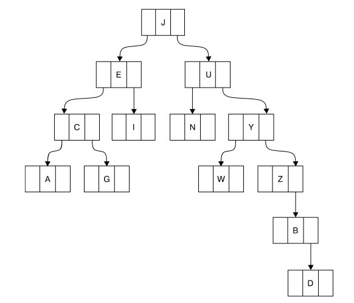
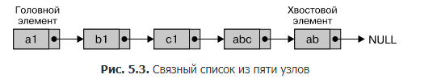
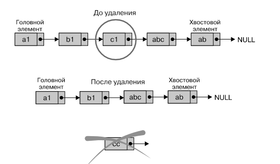
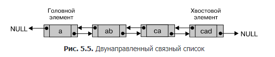
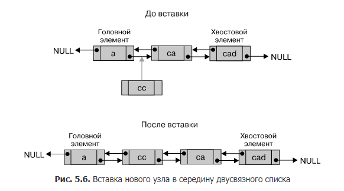

*Глава посвящена разработке и использованию своих собственных структур для хранения, поиска и получения данных*

# графы и узлы;
Граф G( V, E ) - это конечное множество вершин V и множества ребер E. За подробностями обратитесь к курсу теории графов.
# измерение сложности алгоритмов;
Эфективность алгоритма определяется тем, сколько раз програме необходимо обратиться к даным.  
Для описания сложности алгоритмов в информатика используется *нотация О*
Подробнее в курсе Алгоритмы  и структуры данных.
# двоичные деревья;
Дерево, в котором родитель имеет не более 2х потомков.  
Первый узел - корень дерева.   
Количество уровней - глубина или высота дерева.  
Лист - узел без дочерних узлов.
  
несбалансированное двоичное дерево  

Реализация в Go

```go 
package main

import (
    "fmt"
    
    
)

type Tree struct{
    Left *Tree
    Right *Tree
    Value int
}

// обход дерева 
func travelers (t *Tree){
    if (t == nil){
        return
    }
    travelers(t.Left)
    fmt.Println(t.Value)
    travelers(t.Right)
}

// добавление в дерево 
func insert (t *Tree, v int){
    if (t == nil){
        return &Tree{Left: nil. Right: nil, Value: v }
    } 
    if (t.Value < v){
        t.Right = insert(t.Right, v)
        return t
    }
    if (t.Value > v){
        t.Left = insert(t.Left)
        return t
    }
    if (t.Value == v){
        return t
    }
}

func create (n int) *Tree{
    t := *Tree
    for i:= 1; i < n; i++{
        insert(t, i)
    }
}

func main (){
    tree := create(20)
    travarse(tree)
}

```
## Преимуцество двоичных деревьев  
Бинарные деревья имеют упорядоченную структура, так что операции поиска, вставки и удаления из дарева могут выполняться за O(log(n))

# пользовательские хеш-таблицы;
Хеш-таблица — это структура данных, в которой хранится одна или несколько пар «ключ — значение» и используется хеш-функция для вычисления индекса.   
Хорошая хеш-функция должна обеспечивать равномерное распределение значений хеш-функции, потому что неэффективно иметь неиспользуемые блоки или большие различия в размере блоков. 
Много всего интересного...
# связные списки;
Связный список — это структура данных, состоящая из конечного множества элементов.   
  




# двунаправленные связные списки;
  


# работа с очередями в Go;
очредь — это особый вид связного списка, в котором элементы вставляются в на-чало, а удаляются из хвоста. 

Реализация в go 

```go 
package main

import "fmt"

type node struct {
	next  *node
	value int
}

type queqe struct {
	head *node
	tail *node
}

func (q *queqe) push(v int) {
	n := node{value: v}
	if q.head == nil {
		q.head = &n
		q.tail = &n
		return
	}
	q.tail.next = &n
	q.tail = q.tail.next
}

func (q *queqe) pop() (v int) {
	if q.head == nil {
		panic("123")
	}
	tmp := q.head
	q.head = q.head.next
	return tmp.value
}

var Q queqe

func main() {

	Q.push(1)
	Q.push(2)
	Q.push(3)
	fmt.Print(Q.pop())
	fmt.Print(Q.pop())
	fmt.Print(Q.pop())

}
```
# стеки;
# структуры данных, предлагаемые стандартным Go-пакетом container;
Go container. Пакет container поддерживает три структуры данных: кучу, список и кольцо.  Они реализваны в container/heap, container/list и container/ring соответственно.  
Кольцо представляет собой циклический список, так что последний элемент кольца указывает на его первый элемент.  


## container/heap  
пакет container/heap реализует кучу — дерево, где значение каждого узла является наименьшим элементом в его поддереве. Обратите внимание, что я использую выражение «наименьший элемент».  
нeобходимо самостоятельно разработать способ, позволяющий определить, какой из двух элементов меньше.
в Go используются интерфейсы, которые позволяют определять такое поведение.
Строго говоря, пакет 
container/heap требует реализации container/heap.Interface, который определя-ется следующим образом:
```go 
type Interface interface {    
    sort.Interface
    Push(x interface{})   // вставляет x как элемент Len()    
    Pop() interface{}     // удаляет и возвращает элемент Len() - 1
}

```

 для соот-ветствия интерфейсу Go требуется реализация одной или нескольких функций или других интерфейсов, в данном случае это sort.Interface и функции Push() и Pop()

 Для sort.Interface необходимо реализовать функции Len(), Less() и Swap().


 ```go 


 package main
 import (    
    "container/heap"
    "fmt"
    )
 type heapFloat32 []float32


func (n *heapFloat32) Pop() interface{} {
        old := *n
        x := old[len(old)-1]
        new := old[0 : len(old)-1]
        *n = new
        return x
    }
func (n *heapFloat32) Push(x interface{}) {
    *n = append(*n, x.(float32))
    }

func (n heapFloat32) Len() int {
    return len(n)
    }
func (n heapFloat32) Less(a, b int) bool {
    return n[a] < n[b]
}
func (n heapFloat32) Swap(a, b int) {    
    n[a], n[b] = n[b], n[a]
}

func  main() {
    myHeap := &heapFloat32{1.2, 2.1, 3.1, -100.1}    
    heap.Init(myHeap)    
    size := len(*myHeap)    
    fmt.Printf("Heap size: %d\n", size)    
    fmt.Printf("%v\n", myHeap)

    myHeap.Push(float32(-100.2))    
    myHeap.Push(float32(0.2))    
    fmt.Printf("Heap size: %d\n", len(*myHeap))    
    fmt.Printf("%v\n", myHeap)    
    heap.Init(myHeap)    
    fmt.Printf("%v\n", myHeap)
    }

 ```

## container/list
 В пакете container/list реализован двусвязный список

## container/ring
ring.Do() позволяет вызывать функцию для каждого элемента кольца в хронологическом порядке. Но если эта функция вносит какие-либо изменения в кольцо, то поведение ring.Do() становится неопределенным.
Оператор x.(int) называется утверждением типа  
проблема с кольцами — это то, что мы можем вызывать ring.Next() до бесконечности, поэтому нужно найти способ, как это прекратить. В данном случае это сделано с помощью функции ring.Len(). Я предпочитаю использовать для перебора всех элементов кольца функцию ring.Do(), поскольку она генерирует более чистый код, 

# выполнение матричных вычислений;
# работа с головоломками судоку;
# Генерация случайних чисел в Go 


# генераци паролей
Если вы хотите генерировать на Go более безопасные псевдослучайные числа, следует использовать пакет crypto/rand, в котором реализован криптографически безопасный генератор псевдослучайных чисел.
